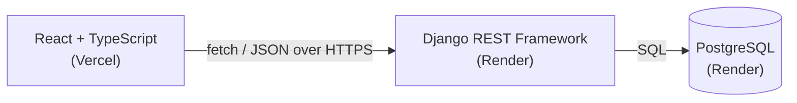

# TripSplit

A group trip expense splitter for India — add shared expenses, and TripSplit works out who owes whom with the fewest possible payments, with a one-tap **UPI** link or QR code to settle up.

**[Live demo →](https://tripsplit-nine-topaz.vercel.app/)**

## Features

- Create a trip with members (name + UPI ID) and get a shareable link — no login required.
- Add, list, and delete expenses; split equally between everyone or a chosen subset of members.
- See net balances and a minimal list of suggested payments to settle up.
- One-tap UPI payment link on mobile, a scannable QR code on desktop, and "Copy UPI ID" as a fallback.
- Mark payments as settled and see a full settlement history.

## Tech stack

| Layer | Choice |
|---|---|
| Backend | Python 3.12, Django 5.2, Django REST Framework |
| Database | PostgreSQL in production, SQLite for local dev |
| Frontend | React 19 + TypeScript (Vite), Tailwind CSS v4, React Router v7 |
| QR codes | qrcode.react |
| Backend hosting | Render (gunicorn + WhiteNoise) |
| Frontend hosting | Vercel |
| CI | GitHub Actions — backend tests + frontend lint/test/build on every push |

## Architecture



The frontend and backend are deployed independently, on different hosts, and only ever talk to each other over a CORS-enabled JSON API — there's no server-rendered coupling between them.

## How the debt simplification works

Expenses create a web of who-owes-whom. Rather than asking everyone to pay back exactly what they owe to exactly who they owe it to, TripSplit reduces that down to the fewest payments that settle everyone up.

**Example** — Alice, Bob, Carol, and Dave on a trip:

- Alice pays ₹1200 for dinner, split 4 ways (₹300 each)
- Bob pays ₹400 for a taxi, split 4 ways (₹100 each)

Net balances come out to:

| Member | Paid | Owes | Net balance |
|---|---|---|---|
| Alice | ₹1200 | ₹400 | **+₹800** (is owed) |
| Bob | ₹400 | ₹400 | ₹0 |
| Carol | ₹0 | ₹400 | **−₹400** (owes) |
| Dave | ₹0 | ₹400 | **−₹400** (owes) |

A naive settlement could take up to 3 payments (everyone individually pays back everyone they owe). TripSplit's greedy algorithm instead repeatedly matches the biggest creditor with the biggest debtor:

1. Alice (+800) ↔ Carol (−400) → **Carol pays Alice ₹400**. Alice is now +400.
2. Alice (+400) ↔ Dave (−400) → **Dave pays Alice ₹400**. Everyone is at ₹0.

Two payments settle the whole trip. In general, this greedy approach needs at most **n − 1** payments for n people with a nonzero balance. It isn't always the mathematically optimal minimum (finding the true minimum is NP-hard), but it's good enough in practice — and deterministic, since ties are broken by member id, so the same balances always produce the same suggested payments.

## Design decisions

- **Money is always an integer number of paise**, both backend and frontend — never a float. Floats can't represent amounts like ₹0.10 exactly in binary, and repeated float arithmetic on money silently accumulates rounding errors. Rupee amounts only ever exist as strings at the API boundary (parsed via `Decimal`, rejecting more than 2 decimal places); everywhere else, it's integer paise.
- **Equal splits are deterministic.** Leftover paise from an uneven split (e.g. ₹100 ÷ 3) go one each to the members with the lowest ids, so the same input always produces the same output.
- **Balances and suggested payments are never stored** — they're recomputed fresh from the full expense and settlement history on every request. Only completed settlements are persisted, since any new expense changes who owes whom.
- **Access is by unguessable share-link only**, like Google Docs "anyone with the link" sharing — there are no user accounts in v1.

## Limitations

Being upfront about what this doesn't do:

- **Payment confirmation is manual.** A UPI deep link can open a payment app, but nothing here can verify money actually changed hands — "Mark as paid" is based on trust, not a payment gateway webhook.
- **Some UPI apps block prefilled peer-to-peer links** for anti-fraud reasons, which is why "Copy UPI ID" exists as a fallback.
- **Share links are the only access control.** Anyone with the link can add expenses or mark payments as settled — fine for a trip among friends, not for anything requiring real authorization.
- **The debt-simplification algorithm isn't always the theoretical minimum** number of payments (that's NP-hard to compute exactly) — it's a fast greedy approximation that's optimal or near-optimal in practice.

## Running locally

**Backend**
```bash
cd backend
python -m venv venv
venv\Scripts\activate          # Windows; use `source venv/bin/activate` on macOS/Linux
pip install -r requirements.txt
cp .env.example .env           # fill in DJANGO_SECRET_KEY at minimum
python manage.py migrate
python manage.py runserver
```

**Frontend**
```bash
cd frontend
npm install
cp .env.example .env           # VITE_API_URL should point at the backend above
npm run dev
```

**Running tests**
```bash
cd backend && python manage.py test   # 48 tests
cd frontend && npm test               # 25 tests
```

## Future improvements

- Unequal splits: exact amounts or percentages per member
- Expense categories with a spending breakdown
- Editing an existing expense
- Exporting a trip summary as PDF
- Rate limiting on write endpoints
- Optional accounts, to see "my trips" across devices
